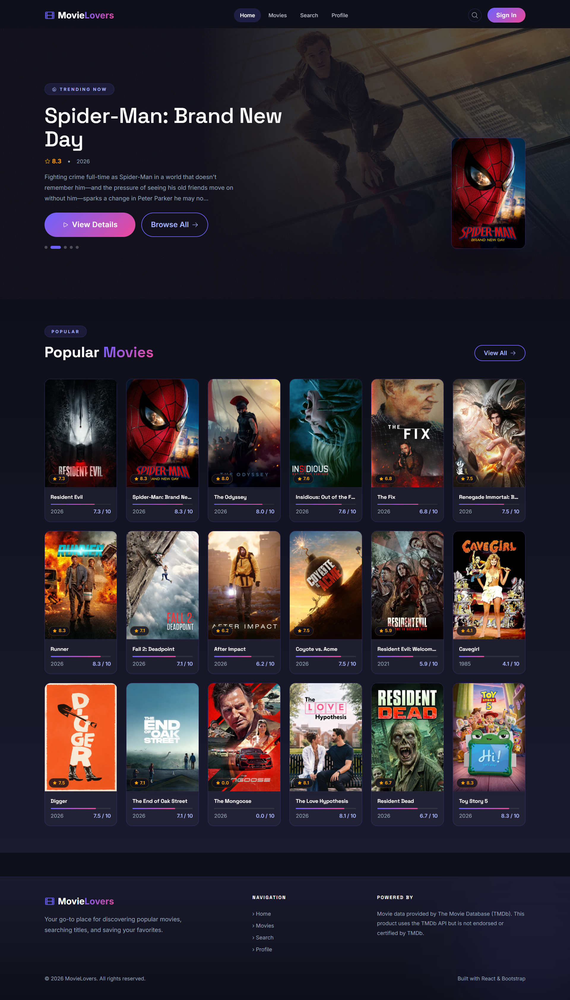
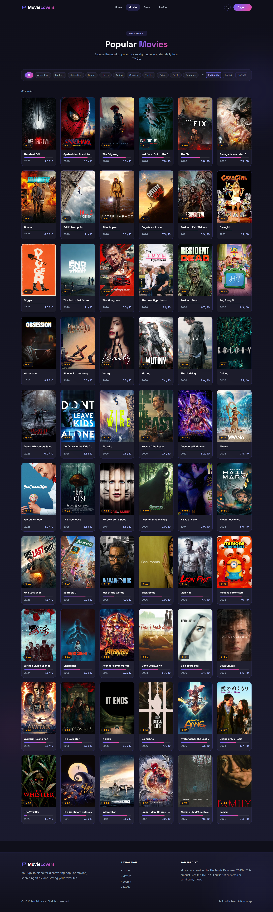
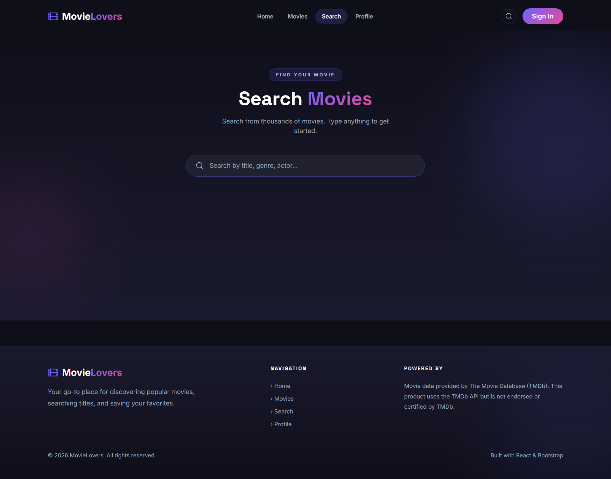
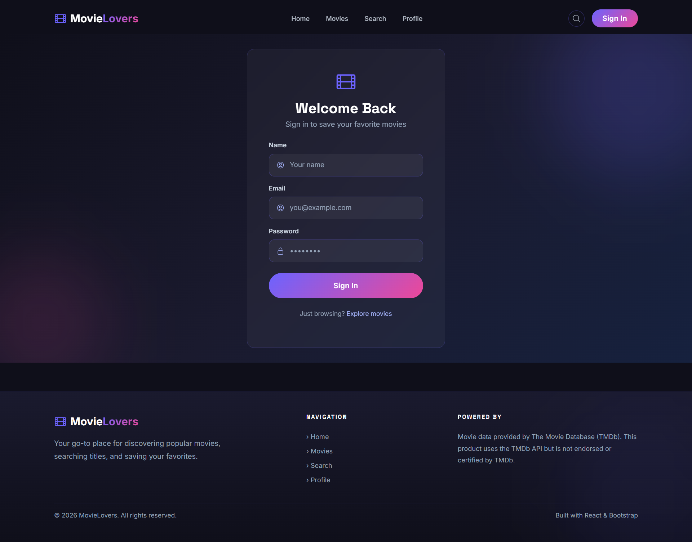

# 🎬 MovieLovers

A modern movie discovery app built with React, Redux Toolkit, and Bootstrap. Browse popular movies, search titles, view detailed info, and save your favorites — all powered by the TMDb API.

---

## Screenshots

### Home


### Hero Section


### Popular Movies


### Search


### Login


---

## Features

- **Popular Movies** — fetches 60 movies across 3 pages from TMDb, displayed in a responsive grid
- **Cinematic Hero** — auto-cycling backdrop with movie info, dots navigation, and a 3D side poster
- **Movie Details** — full info including title, poster, overview, rating, runtime, language, genres, release date, and top cast
- **Movie Search** — debounced live search as you type with result count
- **Genre Filter & Sort** — filter movies by genre, sort by popularity, rating, or release date
- **User Authentication** — sign in with name and email, session persisted in localStorage
- **Favorites / Watchlist** — logged-in users can heart any movie, saved to localStorage via Redux
- **Private Route** — profile page is protected, redirects to login if not signed in
- **Loading Skeletons** — shimmer effect on movie posters while images load
- **Error Handling** — friendly error states on every page
- **Fully Responsive** — works on mobile, tablet, and desktop

---

## Tech Stack

| Layer | Technology |
|---|---|
| UI Framework | React 19 + Vite |
| State Management | Redux Toolkit + React Redux |
| Routing | React Router DOM v7 |
| HTTP Client | Axios |
| Styling | Bootstrap 5 + Custom CSS |
| Icons | Heroicons v2 |
| Movie Data | TMDb API v3 |

---

## Project Structure

```
src/
├── assets/             # Screenshots and static images
├── components/
│   ├── Navbar/         # Navbar with auth-aware links
│   ├── MovieCard/      # Reusable movie card with shimmer, rating bar, favorites
│   ├── MovieSearch/    # Search input + results
│   ├── Footer/         # Site footer
│   └── PrivateRoute.jsx
├── data/
│   ├── api.js          # Axios instance configured for TMDb
│   └── constants.js    # Nav links, image base URLs
├── pages/
│   ├── Home.jsx        # Hero + popular movies preview
│   ├── MovieList.jsx   # All movies with genre filter and sort
│   ├── MovieDetails.jsx# Full movie info + cast
│   ├── Search.jsx      # Search page
│   ├── Login.jsx       # Sign in form
│   └── Profile.jsx     # User profile + favorites
├── redux/
│   ├── store.js        # Redux store
│   ├── movieSlice.js   # Movies state — popular, search, details
│   └── authSlice.js    # Auth state — user, favorites
├── styles/
│   └── globals.css     # CSS variables, glass card, gradients, utilities
├── App.jsx             # Routes
└── main.jsx            # Entry point — Provider + BrowserRouter
```

---

## Getting Started

### 1. Clone and install

```bash
git clone https://github.com/your-username/movie-lovers.git
cd movie-lovers
npm install
```

### 2. Get a TMDb API key

- Go to [https://www.themoviedb.org/settings/api](https://www.themoviedb.org/settings/api)
- Create a free account and request an API key
- Copy the **API Key (v3 auth)**

### 3. Add your API key

Open `src/data/api.js` and replace the key:

```js
const API_KEY = 'your_tmdb_api_key_here'
```

### 4. Run the app

```bash
npm run dev
```

Open [http://localhost:5173](http://localhost:5173)

---

## Available Scripts

| Script | Description |
|---|---|
| `npm run dev` | Start development server |
| `npm run build` | Build for production |
| `npm run preview` | Preview production build |
| `npm run lint` | Run ESLint |

---

## API Reference

All data comes from [The Movie Database (TMDb)](https://www.themoviedb.org/).

| Endpoint | Used For |
|---|---|
| `/movie/popular` | Fetch popular movies (pages 1–3) |
| `/movie/:id` | Fetch movie details |
| `/movie/:id/credits` | Fetch cast |
| `/search/movie` | Search movies by query |

> This product uses the TMDb API but is not endorsed or certified by TMDb.

---

## Notes

- TMDb may be blocked on some ISPs/networks. If you get a network error, try a VPN or mobile hotspot.
- Favorites and user session are stored in `localStorage` — they persist across page refreshes.
- The app fetches 60 movies on load (3 pages × 20 results).
